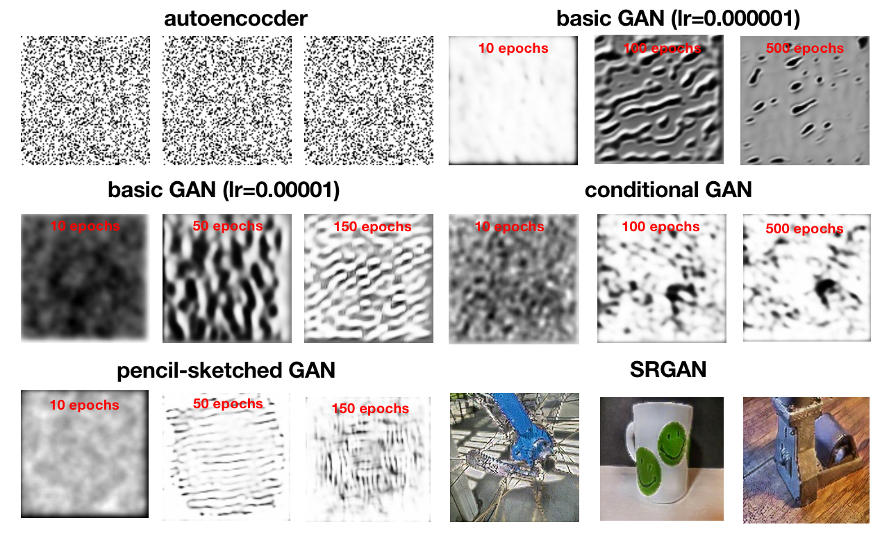

# AMLS_assignment23_24-SN23043574
This is the final assignment for 23/24 AMLS II ELEC0135 Msc IMLS SN23043574. Notice that the project is also provided with Google drive link provided in my paper. The usage is illustrated in following sections.
>**Time:** 29/01/2023-11/04/2024 \
**Author:** 23043574 \
**Programme:** Msc Integrated Machine Learning Systems (TMSIMLSSYS01) \
**Module**: ELEC0135 Applied Machine Learning Systems II \
**Project name:** AMLS II final assignment \
**Scope:** Deep Learning, Computer Vision, Research, Simulation \
**Github:** https://github.com/uceewl4/AMLS_II_assignment23_24-SN23043574.git . The private respository will become public once the deadline is passed. Notice that there are two versions of the project. The first one is the test version for about 5G(on Github and You can also download the project through Google Drive link provided in the report: https://drive.google.com/drive/folders/1QGrWxrC9I7W_bzYCvaJmsU3dMeyvCBg5?usp=sharing). The second one is the complete version for about 13G on the following link: https://drive.google.com/drive/folders/13t4ZmSbIPnrcFHQK0iVv-zsMFnhp2ah2?usp=sharing .
To emphasize, the test version doesn't include outputs images and point cloud features, so the method of multimodal cannot be run on it. Besides, most part of the project is run on UCL GPU server of london.ee.ucl.ac.uk (you can also find my folder at /scratch/uceewl4/AMLS_II_assignment23_24-SN23043574), so it will be much slower if you run it on CPU. Some quicker models are recommended in the usage for you to run on CPU with small epochs. Please also see the video demonstration in Google Drive as well. Please follow the guidelines in Requirement and Usage to run the project. Thanks a lot.

## Description
### 1. Project Structure 
- **main.py:** main codes for running the project
- **utils.py:** tools, visualizations and metrics
- **requirement.txt:** package requirements for the project
- **environmental.yml:** conda environment for the project
- **data_preprocessing.py:** procedures for preprocessing the images
- **get_dataset.py:** procedures for getting the dataset and split
- **yolov8n.pt:** model used in product detection
- **yolov8s-obb.pt:** model used in product detection
- **example1:** images on README
- **example2:** images on README
- **datasets**
  - augmented: augmentation data in adversarial attacks
  - contour: contour images for multimodal 
  - pc: point cloud for multimodal
  - pencil: pencil-sketched images 
  - preprocessed: preprocessed images
  - raw: raw images
  - segemnted: segmentation images for multimodal
  - yolocustom-6: dataset for product detection
    
- **image_classification**
  - **AdvCNN.py:**: model implementation for adversarial CNN
  - **CNN.py:**: model implementation for CNN
  - **MoE.py:**: model implementation for multi-agent
  - **Multimodal.py:**: model implementation for multimodal
  - **pretrained.py:**: model implementation for pretrained models
  - **ViT.py:**: model implementation for vision transformer

- **image_generation**
  - **AutoEncoder.py:**: model implementation for autoencoder
  - **BaseGAN.py:**: model implementation for basic GAN
  - **ConGAN.py:**: model implementation for conditional GAN
  - **PencilGAN.py:**: model implementation for pencil-sketched GAN
  - **SRGAN.ipynb:**: implementation process for SRGAN

- **object_detection**
  - **YoLoCustom.ipynb:**: implementation process for object detection

- **outputs**: all outputs of the project including generated images, metrics and visualization from modelling experiments and trials. 
  - **image_classification:** generated images from the task of image classification
    - **adversarial:** images of adversarial attacks
    - **confusion_matrix:** confusion matrix for experiments
    - **metric_lines:** accuracy and loss along epochs for different methods
    - **nn_curves:** NN curves generated by TensorboardX
    - **ViT:** generated patches of vision transformer
  - **image_generation:** generated images from the task of image generation
    - **autoencoder:** generated images of autoencoder
    - **baseGAN:** generated images of basic GAN
    - **conGAN:** generated images of conditional GAN
    - **models:** saved models of image generation
    - **pencilGAN:** generated images of pencil GAN
  - **histogram_example.png:** histogram equalization example of CLAHE

- **point_e_model_cache**: used for generating point cloud features with Point-E library 
- **point-e**: used for generating point cloud features with Point-E library  
- **runs**: this directory may also be generated by TensorboardX if you are checking and running networks. 

### 2. Experimental Results
> Modelling experiments and trials are conducted for product classification, image generation and product detection and the performance of various methods in DL and computer vision is compared accordingly.

2.1 Product classification results
| **Models**      | **train** |       |       |       | **val**   |       |       |       | **test** |       |      |      |
|:---------------:|:---------:|:---------:|:---------:|:---------:|:---------:|:---------:|:---------:|:---------:|:--------:|:---------:|:--------:|:--------:|
|     | acc       | pre       | rec       | f1        | acc       | pre       | rec       | f1        | acc      | pre       | rec      | f1       |
| **CNN**   | 99.8667   | 99.8669  | 99.8667  | 99.8667  | 100.0000 | 100.0000 | 100.0000 | 100.0000 | 34.5000 | 37.9577 | 34.5000 | 34.6458  |
| **Multilabel CNN**           | 100.0000  | 100.0000 | 100.0000 | 100.0000 | 100.0000 | 100.0000 | 100.0000 | 100.0000 | 61.4583 | 61.6948 | 61.4583 | 661.5167 |
| **Adversarial CNN**      | 95.3333   | 95.3655  | 95.3326  | 95.3410  | 32.2308  | 31.6706  | 32.2034  | 31.3904  | 35.0385 | 35.1270 | 34.4164 | 34.3058  |
| **Multi-agent**          | 100.0000  | 100.0000 | 100.0000 | 100.0000 | 34.1667  | 34.0854  | 34.1667  | 33.9762  | 36.5000 | 36.4811 | 36.5000 | 36.2643  |
| **Multimodal**           | 83.4833   | 84.5016  | 83.4833  | 83.4711  | 40.0000  | 40.7250  | 40.0000  | 38.9479  | 40.2500 | 40.9576 | 40.2500 | 39.1030  |
| **Inceptionv3**          | 11.6667   | 34.9878  | 11.6667  | 6.2712   | 10.3750  | 8.1557   | 10.3750  | 4.7191   | 11.0033 | 11.0033 | 23.6902 | 5.3732   |
| **ResNet-50**            | 99.9333   | 99.9335  | 99.9333  | 99.9333  | 59.8750  | 60.3999  | 59.8750  | 59.9116  | 59.7083 | 59.7083 | 60.2864 | 59.8183  |
| **VGG-19**               | 99.8167   | 99.8173  | 99.8167  | 99.8166  | 56.5417  | 56.5750  | 56.5417  | 56.1112  | 57.4583 | 57.4583 | 57.5128 | 57.1736  |
| **MobileNetV2**          | 65.9500   | 66.7821  | 65.9500  | 65.7677  | 32.2083  | 31.9095  | 32.2083  | 31.5849  | 34.7083 | 34.7083 | 34.2652 | 34.0402  |
| **NASNetMobile**         | 68.9667   | 71.9261  | 68.9667  | 69.4246  | 19.8750  | 19.4869  | 19.8750  | 19.3109  | 19.7500 | 19.7500 | 18.9218 | 18.7715  |
| **ViT**                  | 98.5833   | 98.7496  | 98.5833  | 98.6103  | 98.5833  | 98.7496  | 98.5833  | 98.6103  | 17.0000 | 16.5990 | 17.0000 | 16.3062  |

2.2 Image generation examples

2.3 Product detection

## Requirements
  Original developing environment:
  - Visual Studio Code 1.85.0 (Universal)
  - **CPU platform:** Python 3.11.7 and Anaconda virtual environment for conda 23.7.4. You can check all requirements in requirements.txt and environment in environment.yml. 
  - **GPU plaform:** UCL server: london.ee.ucl.ac.uk with Python 3.11.5, Anaconda virtual environment for conda 23.7.4 and cuda version 12.2.
  - Notice that the project is recommended to run on GPU server where CPU of your computer could be much slower. It's also better to run SRGAN/YOLOv5 on Google Colab.

## Usage
- Step 1: Create environment with corresponding version mentioned in **Requirements** with Anaconda Navigator.
- Step 2: Install requirement packages for the environment: 
  
<code>pip install -r requirements.txt</code>

  It's also ok for you to combine step 1 and 2 together to run:
    
<code>conda env create -f environment.yml</code>

****Notice:** Notice that the test version and complete version of the project is provided in different Google Drive links. Please choose your preferred one to run.**

- Step 3: you can run the project with the following commands.
** Notice: Most of the project is run on GPU server, it may be much slower to run on CPU. So it's suggested that if you want to check the model implementation on CPU, try some fast model to see their performance as recommended. Besides, you need to explicitly set task as IG for image generation models.**

      image_classification(IC): default CNN, VGG19, AdvCNN, etc. (You can also try other models on GPU through my folder in /scratch/uceewl4/ or can set a small epoch on CPU to see their performance.)
      image_generation(IG): AutoEncoder, etc. (It's not recommended to run GAN models on CPU since they are very slow.)
      object_detection: the notebook result of Google Colab is provided in folder of runs.
  
<code>python main.py --epochs 1</code>

  
<code>python main.py --method AdvCNN --epochs 1</code>

  
<code>python main.py --method CNN --multilabel True --epochs 1</code>

  
<code>python main.py --method VGG19 --epochs 1</code>

  
<code>python main.py --task IG --method AutoEncoder --epochs 1</code>

  **Notice that the argument of pre_data must be set as True to download datasets and check data preprocessing initially. There are several other arguments which can be specified to select different model scenario. Default scenario is LR baseline for task A. You can specify the argument as follows:**

    --task: image classification (IC) or image generation (IG). **If you want to run image generation models, the task must be set as IG.

    --method: model selected, default CNN. for IC, the model could be "CNN", "AdvCNN", "Multimodal", "MoE", "ResNet50", "InceptionV3", "MobileNetV2"."NASNetMobile", "VGG19", "ViT"; for IG, the model could be "ConGAN", "AutoEncoder", "BaseGAN", "PencilGAN". **Notice that your choice of task and method must be compatible.**

    --batch_size: batch size of different methods, default 64.

    --epochs: epochs of different methods, default 10.

    --lr: learning rate of different methods, default 0.00001.

    --multilabel: whether set multilabels scenario, default False.  **only used for CNN.**

 
        
